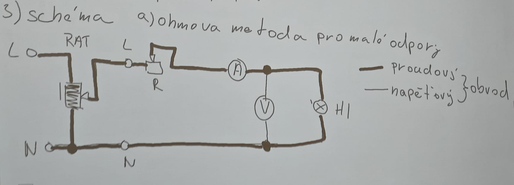
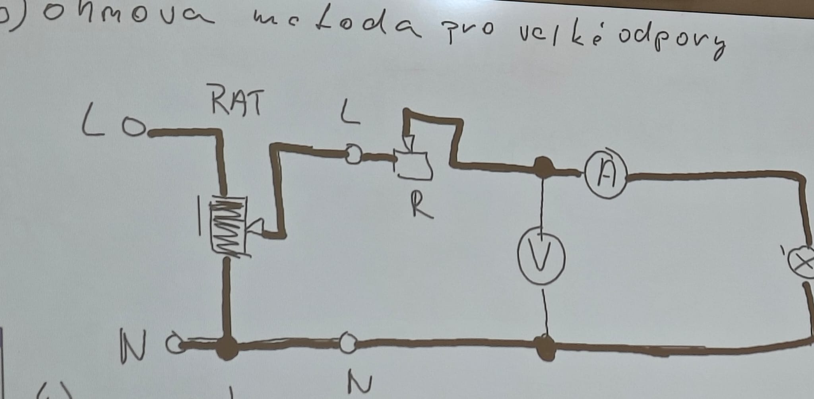
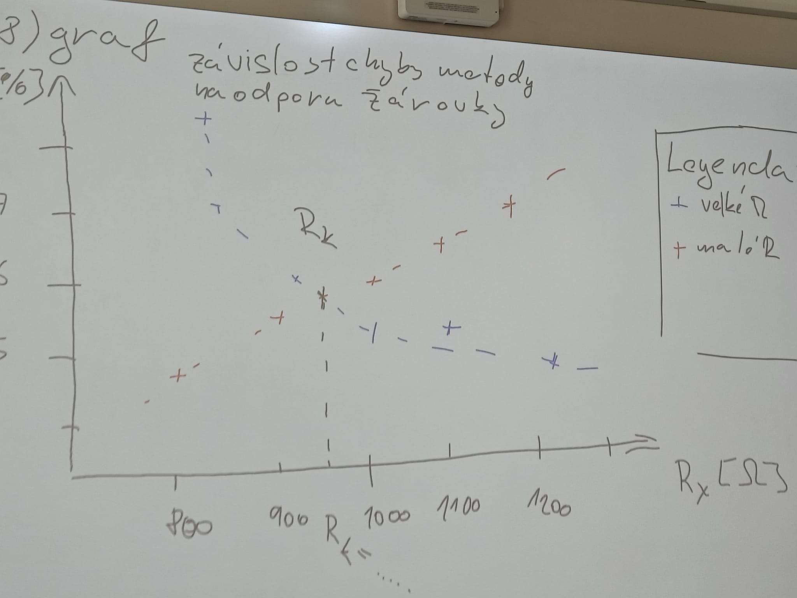

# P3 - měření odporu žárovky

### 1) Zadání:

### 2) Měřený předmět

    Hl -žárovka, 40w/240V

### 3)schéma
    a) ohmova metoda pro malé obvody
    
    b) ohmova metoda pro velke odpory
    

### 4) použité přístroje

    rosahy podtrhnout!!

    A - ampermetr - rozsahy, p.rozsah, TP, systém, č.ul.
    R - posuvný resistor - xohm/yA, č.ul.
    V - voltmetr - rozsahy, p.rozsah, TP, systém, č.ul.
    RAT - regulovatelný autotransformátor - součást stolu/štítek

### 5 postup
    
### 6) tabulka v souboru tabulka

### 7) příklad výpočtu 

a)

    R= U/I [ohm]
    Ix = I - Iv = I - U/Rv [A]
    Rx = U/Ix [ohm]
    δm = (R-Rx)/Rx *100 [%]
    
b)

        R= U/I [ohm]
        Ux = u- ΔU = U- Ra * I [V]
        Rx = Ux/I [ohm]
        δm = (R-Rx)/Rx *100 [%]
    
přikon žarovky

    P= U*I [w]

kritický odpor

    Rk(h) = √RA *RV

### 8) Graf
 závislosti chyby metody na odporu žárovky pouzit bezier(prolozit křivku)
 
 

 
