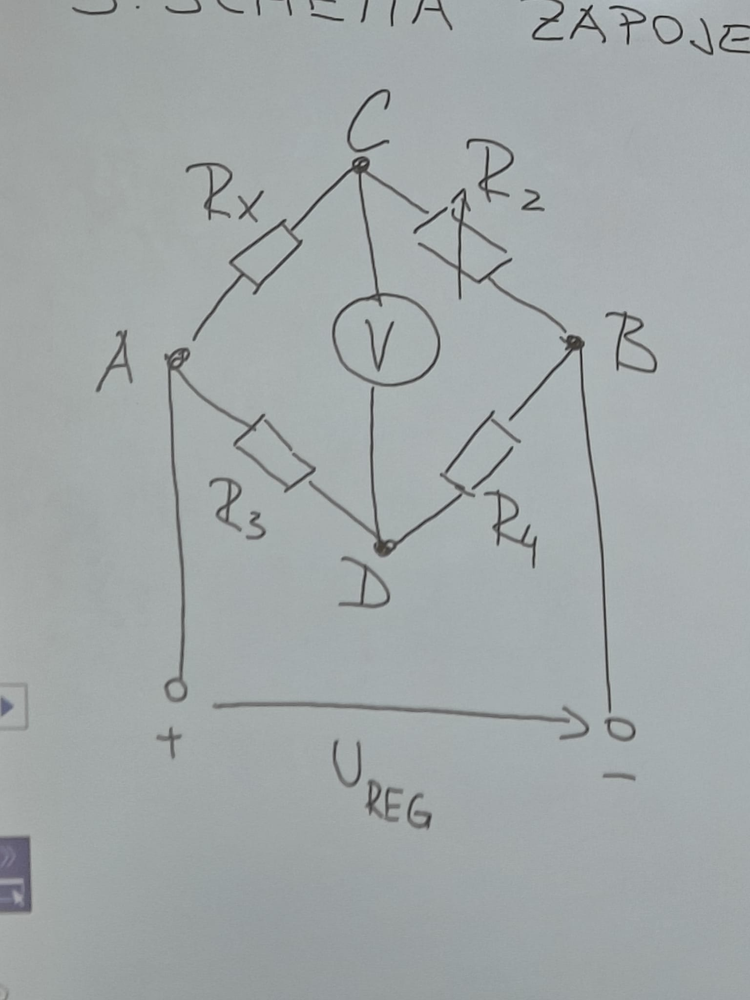

# P4 - wheatstoneův můstek

### 1) Zadání:
Změřte velikost činného odporu předložených rezistorů.
Naměřené hodnoty porovnejte se štítkovými údaji.
Zjistěte experimentálně napěťovou citlivost můstku pro jednotlivá měření.

### 2) Měřený předmět

| ozn.  | štít. mod.      |     typ     | tolerance |
| :---: | :------------:  | :---------: | :-------: |
| Rx1   |                 |             |           |
| Rx2   |                 |             |           |
| Rx3   |                 |             |           |
| Rx4   |                 |             |           |
| Rx5   |                 |             |           |
| Rx6   |                 |             |           |

### 3)schéma
#### a) ohmova metoda pro malé obvody
    

### 4) použité přístroje

    rosahy podtrhnout!!

    Ureg - regulovatelný zdroj - součást stolu/štítek
    V - digitální multimetr - typ, č.ul.
    R2 - odporová dekáda - typ, rozsah(př 1-11111 (rozsah je velký)), č.ul.
    R3 - odporový normál, rozsah, č.ul
    R4 - odporový normál, rozsah, č.ul

### 5 postup

-nulovým indikátorem(digitální multimetr) nesmí téct proud (Ua = Ub) 
- Podmínka rovnováhy Ucd = 0
-z toho plyne 
Rx *R4 = R2*R3 -> Rx = (R2*R3)/R4 -> Rx = R2 * R3/R4

 $$ 
 Rx \cdot R4=R2 \cdot R3
 $$
 
 $$
 Rx= \frac {R2 \cdot R3}  {R4}
 $$
 
 $$
 Rx = R2 \cdot \frac {R3} {R4}
 $$

Můstek funguje na vyvážení můstku. To znamená ýe středním sloupkem neteče žádný proud a tak je tam 0lové napětí. proto je důležité že na Ampermetru je 0. Určení odporu při vyvážení je 

### 6) tabulka v souboru tabulka

### 7) příklad výpočtu 

$$
R_x = R_2 \cdot \frac{R_2}{R_4}
$$

$$
\Delta = 100 \cdot \frac{R_2 - R_{\text{štít}}}{R_{\text{štít}}}
$$

$$
c\,\delta R_x = \frac{c\,\delta R_2}{10 \cdot \frac{R_3}{R_4}}
$$

### 8) Graf není
 
