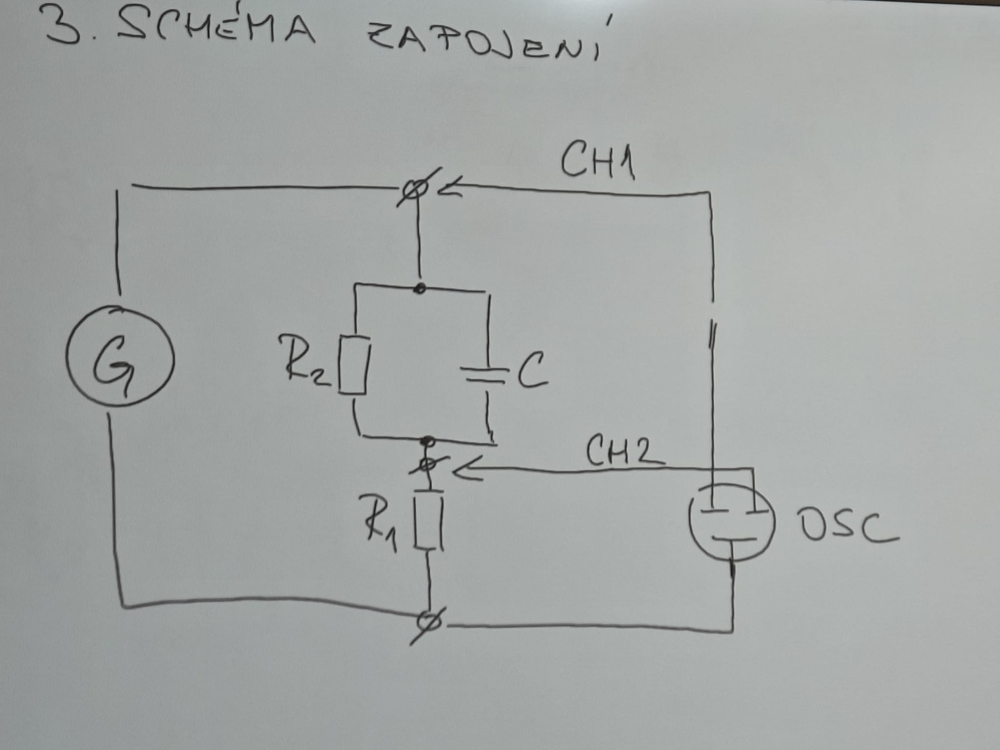
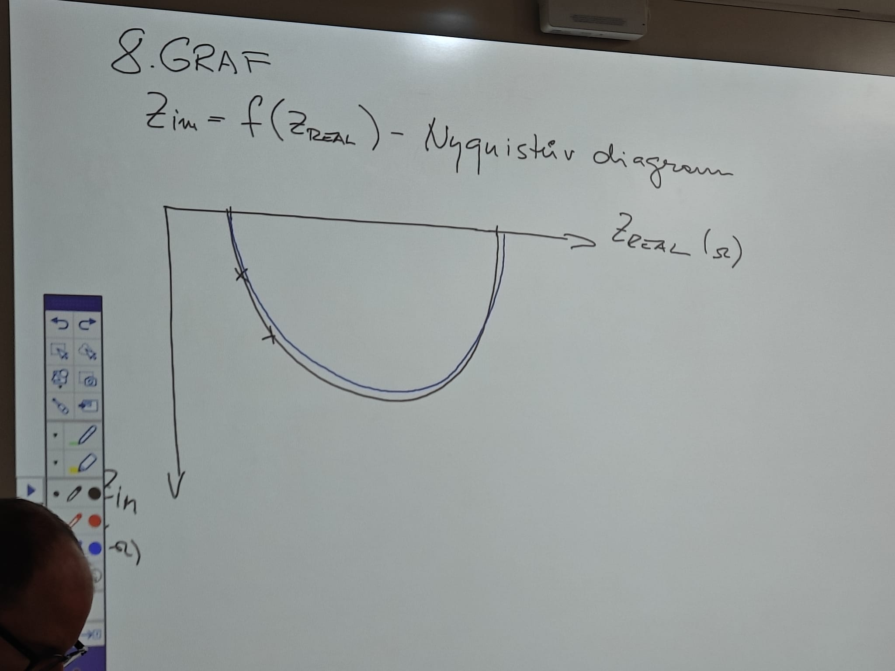

# P5 - Impedanční charakteristika

### 1) Zadání:

Změřte impedanční charakteristiku předloženého obvodu v závislosti na frekvenci, do grafu vyneste závislost imaginární složku impedance na reálné složce impedance.

### 2)mšřený předmět

obvod složený z odporu R1 v sérii s paralelním zapojením odporu Rz a kondenzátoru C

$$
R_1 = 39 ohm
$$

$$
R_2 = 1000 ohm
$$

$$
C = 0,1microf
$$
### 3)schéma
#### a) ohmova metoda pro malé obvody
    

### 4) použité přístroje

Osc -  digitální osciloskop, č.u
G – generátor osciloskop, č.u. / typ č.u.

### 5 postup

### 6) tabulka v souboru tabulka

### 7) příklad výpočtu 

zvlast v reseni

### 8) Graf

 
